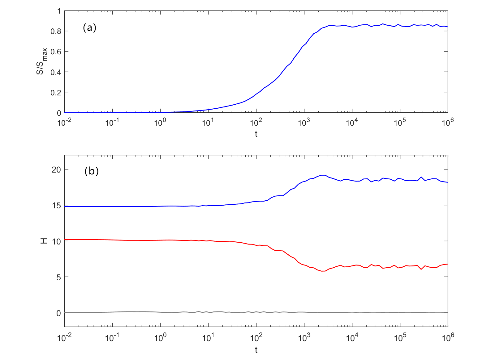
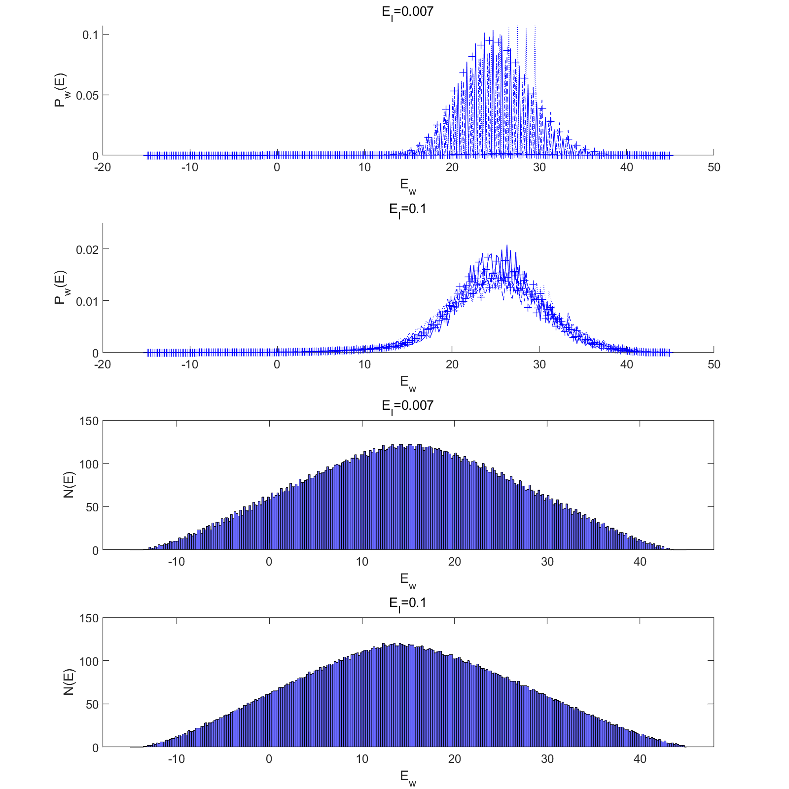

# Research Portfolio: Zixi Xia

**Undergraduate, School of the Gifted Young, USTC, major in Applied Physics**

Email: xzx1602@mail.ustc.edu.cn | [CV](CV_Zixi Xia.pdf)

---

## Numerical Reproduction of Quantum Thermalization
**Investigation of the Eigenstate Thermalization Hypothesis (ETH) in the Adapted Caldeira-Leggett Model**

This project is an **independent reproduction and numerical validation** of the Adapted Caldeira-Leggett (ACL) model, originally proposed by Albrecht et al. (2022). The goal was to investigate the microscopic mechanisms of decoherence and the validity of the Eigenstate Thermalization Hypothesis (ETH) in finite open quantum systems. This is also the course project of *Computational Physics* (graduate course, grade: 100/100).

### Method & Implementation
I implemented the numerical framework **from scratch** (using MATLAB) to perform:
- **Exact Diagonalization** of the composite system Hamiltonian ($H_w=H_s\otimes\mathbf{1}^e+H^I+\mathbf{1}^s\otimes H_e$).
- **Time Evolution** simulation of the density matrix.
- Calculation of **von Neumann Entanglement Entropy** to quantify thermalization.
- Study of system **eigenstate distributions** to understand thermalization.

Key Results (Reproduction)

*Fig 1. Verification of equilibration: The subsystem entropy increases and stabilizes, indicating the transition from a pure state to a statistical mixture.*

*Fig 2. Global energy distribution. Strong coupling leads to smooth distributions (thermalization), while weak coupling shows jagged structures (localization).*

### Key Conclusion

1. **Validation of ETH:** Reproduced the phase transition where strong coupling leads to thermalization, consistent with ETH predictions.

2. **MBL-like Behavior:** Verified that in the weak coupling limit ($E_I = 0.007$), the system fails to thermalize, exhibiting characteristics similar to Many-Body Localization due to preserved local integrals of motion.

3. **Coherent State Dynamics:** Analyzed the decoherence process of initial coherent states in the oscillator subsystem.

    

---

## Current Research: Neural Quantum States (NQS)

*Status: In Progress*

I am currently exploring machine learning approaches to overcome the computational limits of exact diagonalization for high-dimensional Hilbert space.
- **Objective:** Using **Vision Transformers (ViT)** and as variational ansatzes to represent ground states of many-body spin systems.
- **Focus:** Investigating the representational capacity of NQS for highly entangled states compared to tensor network methods.
